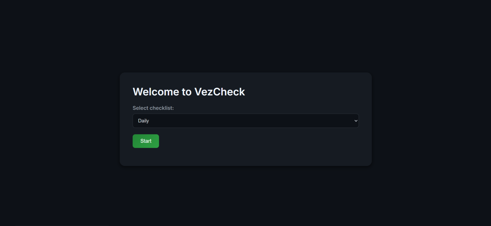
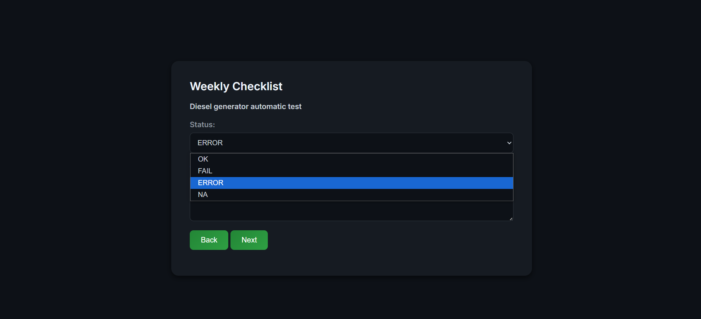
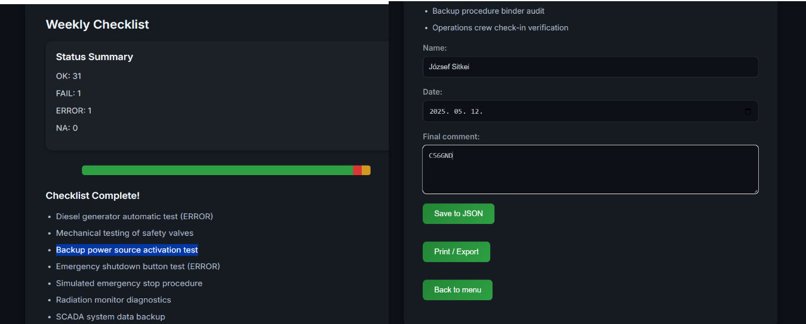

# VezCheckWeb – Digital Checklist Manager

This is a web-based checklist app made in F# with ASP.NET Core.  
It's meant to be used in a nuclear power plant control room for daily, weekly and monthly checks.

## Why I made it

Paper checklists are hard to follow and not so easy to track.  
This app makes it easier to fill in the checklists and save the results.  
Operators can write comments, see stats, and print a final summary.

## What it does

- Lets you choose daily / weekly / monthly checklist
- Each item can be marked as OK / FAIL / ERROR / NA
- You can add a comment to each item
- Saves the full checklist to a .json file with date and name
- Final page shows a summary and can be printed
- Fully working in web browser with dark theme

## Screenshot

### Main Menu  


### Checklist Step  


### Summary Page  



## How to use

You need .NET 8 SDK.  
Then run:

```bash
dotnet run
```

Open your browser and go to [http://localhost:5000](http://localhost:5000)

## Live version

_Will be added soon_ (Render deployment in progress)

## Project info

- Name: József Sitkei  
- Subject: Functional Programming in F#  
- Teacher: Ádám Granicz  
- Project: Omega  
- Deadline: end of semester (last Sunday)  
- LOC: ~360 lines  
- Language: F# (.NET 8)

## Maybe later...

- User login
- Role-based permissions
- Charts and stats
- More checklist types
- Data filtering and search
